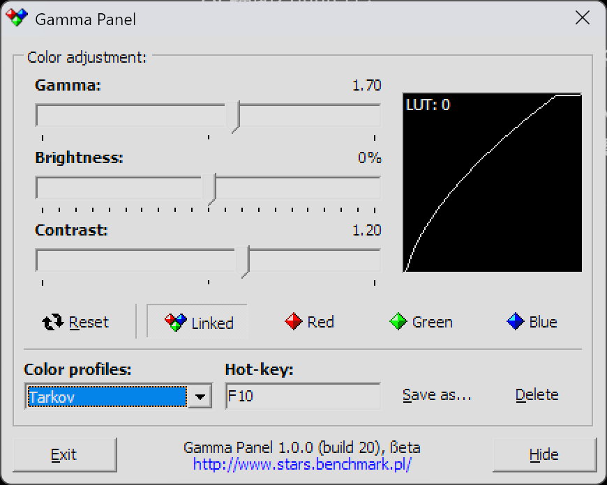
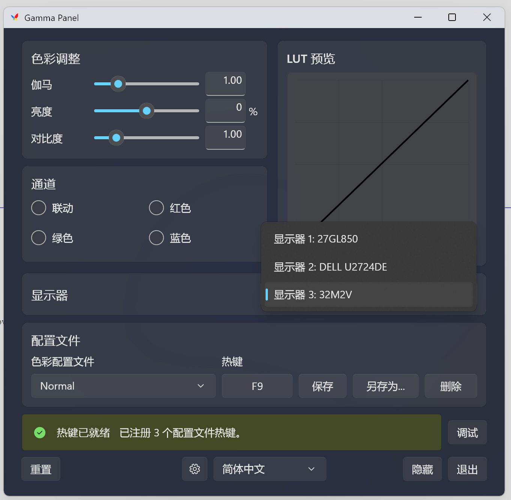
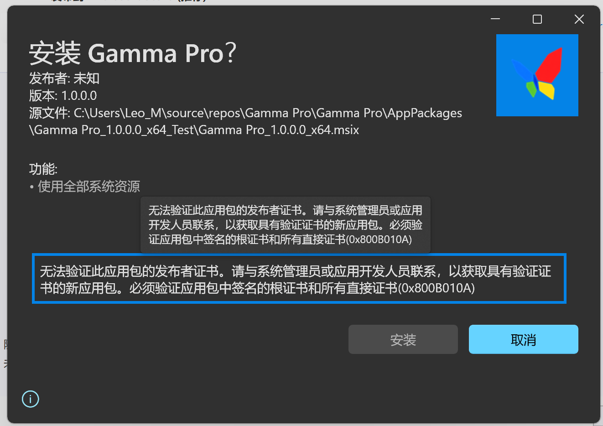
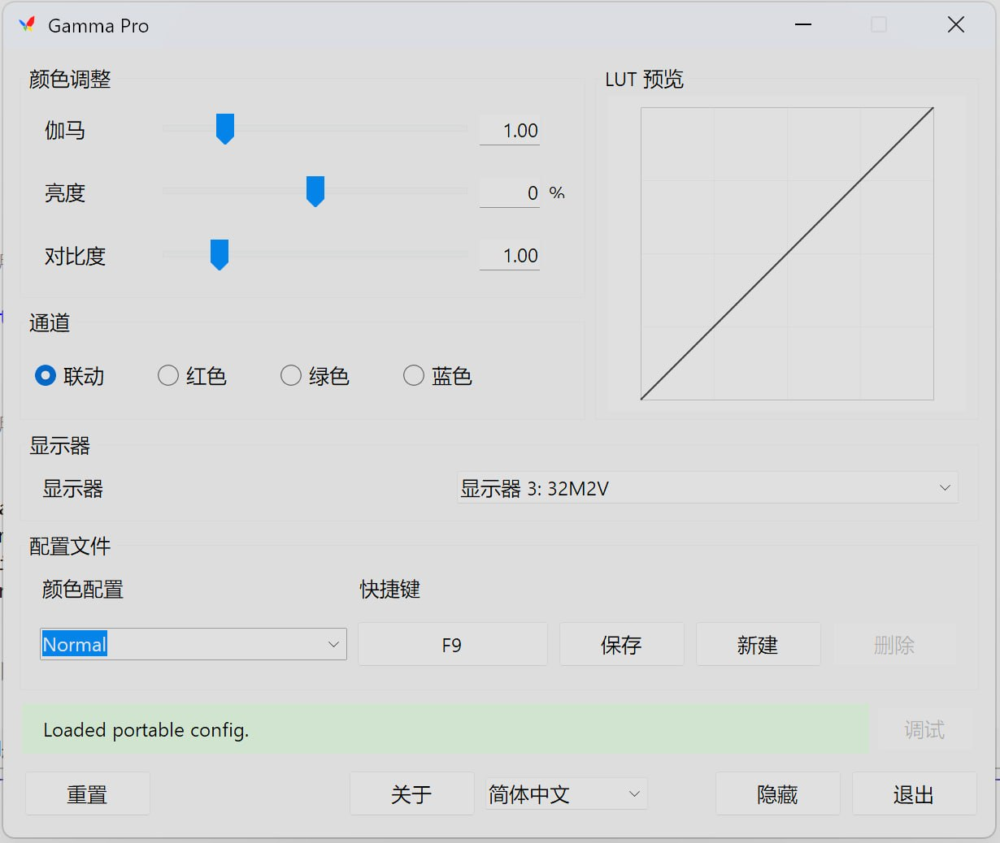
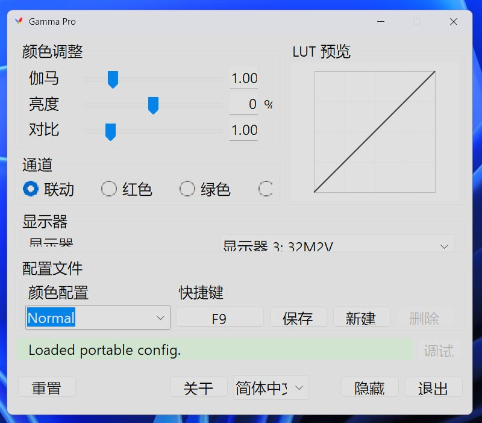

## 前情提要
我和一些固定的游戏搭子们都喜欢玩逃离塔科夫这款游戏。但是这款游戏的光照偏向于昏暗，看不清暗处的细节是常有的事。为了克服这个问题，塔科夫玩家群体之间流传着一个上古小工具，叫做 Gamma Panel，它大概长这样：

很显然这是一款 Win32 技术的，缺乏现代特性的小工具。它的优点在于分发简单，单 exe 即可运行，同目录下有一个 .ini 配置文件，只要替换配置文件就能获得其他人的所有颜色配置，且可执行文件的大小只有 113.5KB，如此低的门槛很容易让人产生试试看的想法，反正不好用就删除，连卸载都免了。

一般来说我们要用到三个配置：初始配置，即恢复显示器正常显示的配置，然后是两个塔科夫配置，称之为一档和二档。一般常用的就是一档，到了特别特别黑的情况下才会用二档，因为改 Gamma 本身也会影响亮处的显示效果，会看不清楚。在这些配置之间切换的时候我们一般用热键触发，方便在游戏里快速提亮或恢复。

这个软件有两个硬伤：第一，它不支持多显示器，只要电脑接了不止一个显示器，那么该工具便无法改变任何一个显示器上的 Gamma 值。第二，在较新的 Windows 版本中，它必须以管理员权限运行才能在窗口失焦的情况下正确响应快捷键，考虑到我们经常是在塔科夫的游戏窗口内使用它，所以这也是个硬伤。为了克服这两个问题，我决心自己开发一款 Gamma 调节工具。

## 初始技术决策
我之前没有开发过 Windows GUI 程序，但是我一直对 Windows 开发这个话题感兴趣，我也读过了[有关文章](https://www.jsnover.com/blog/2026/03/13/microsoft-hasnt-had-a-coherent-gui-strategy-since-petzold/)，介绍了 Windows UI 框架的混乱情况。我想的是，用最新最热的不就行了？微软肯定是把它当亲儿子的。

所以项目一开始，我的技术选型是使用 WinUI 3（现在更名为 WinUI 了）开发 UI，但是保持 Win32 的显示器 Gamma 调节行为，这是因为 Gamma Panel 确定不会触发反作弊，我们希望新软件维持旧行为，所以不支持诸如 HDR 等的现代特性，这是有意为之的。由于这不是我的原创项目，我全程使用 Codex 进行编程。

## Windows App SDK 软件分发问题
很快 Codex 就完成了初步开发，我们有了如下的软件窗口，它的控件看起来十分现代，也正确支持 DPI 缩放相关行为。

于是我打算赶紧把它变成可分发的形式，给我的游戏搭子们先尝试一下，看看有无 bug，然后再开源。然而，这里是一切问题的起点。

### 单文件分发
我希望能尽可能维持 Gamma Panel 的分发形式，即一个 exe 配一个配置文件。然而我不知道的是，编译出来的 exe 大小竟然超过 50MB，远远大于 Gamma Panel 不到 200KB 的大小，这是我不能接受的。后来我了解到，这么大的原因主要是为了实现 self-contained，里面要放一个运行时。就算是使用 MSIX 安装器分发，尺寸也超乎想象。

我甚至为安装器分发方法专门写了配置文件导入/导出的逻辑，因为在安装器的逻辑下，配置文件就不能轻易地和可执行放在同一个目录下了。可惜最后没有用到。

单文件分发还有一个致命的问题，就是证书问题。在最新的 Windows App SDK 下，安装器要求验证文件签名，不可跳过，获得证书的方法除了花钱交保护费别无他法。

这岂不是比 macOS 还严格？至少可以用 dummy signature 来部分规避 GateKeeper 问题。

### 通过 Microsoft Store 分发
既然这样的话，可能用 Microsoft Store 分发比较好，它会自己解决 runtime 依赖的问题，以及证书问题，而且我们可以分发一个引导用户到 MS Store 安装的 exe，类似于国内软件站的“下崽器”，只不过是正规的。双击打开后会帮助用户自动下载，官方名称叫 [Microsoft Store Web Installer](https://learn.microsoft.com/en-us/windows/apps/distribute-through-store/how-to-use-store-web-installer-for-distribution)，我之前用过一两次，体验是不错的。

但是我不认为在中国大陆所有用户的电脑都正确配置了 MS Store，至少我知道它很容易出问题，就算按照微软的步骤配置了微软账户。LTSC 版的用户也没有 MS Store 预装。更何况许多人还是用的默认用户 Administrator，连微软账号也没配置。基于这些原因考虑，我也放弃了通过 MS Store 分发的打算。

## 最终技术决策
于是我必须重写。有了之前的经验教训，这一次技术选型我非常谨慎。之前提到的[那篇文章](https://www.jsnover.com/blog/2026/03/13/microsoft-hasnt-had-a-coherent-gui-strategy-since-petzold/)我又翻出来看，综合分发大小、分发难度以及兼容性，我最终选择了使用基于 .NET Framework 4.8 的 WinForms 进行彻底重写，有这么几个原因：

- WinForms 是基于 Win32 的抽象，只要微软不放弃 Win32 那么我的软件一定能跑。我实在看不到微软真的放弃 Win32 的未来在哪里。
- Windows 10 1903 及以后的所有 Windows 都自带 .NET Framework 4.8 运行时，就算是旧系统（比如 Windows 7）也可以通过加装运行时的方法跑起来，所以兼容性问题我不担心。
- 打包尺寸和 Win32 程序几乎无异，能做到接近 Gamma Panel 的分发尺寸。

所以我立马让 Codex 开工。不多时，WinForms 重写完成了，但是有 DPI 缩放相关的问题。窗口图标模糊的问题算是比较好解决的，Codex 一轮就完成了。但是，窗口本身缩放的 DPI 问题却迟迟得不到解决，症状是：在我的 4K 200% 显示器上效果良好，但是一旦移动到 2K 125% 显示器上，文字的大小甚至比 4K 200% 显示器上的大小还要大。

Codex 许多轮都没有解决这个问题，我抓耳挠腮。我甚至单开了一个测试项目让 Codex 只渲染一个有 Lorem ipsum 文本的窗口（使用主项目一样的技术栈）来测试 DPI 行为。这一次 Codex 确实弄对了，但是有一个重要妥协：要在开发中使用 `App.config` 文件，这个文件最终要求被放置在可执行文件的同一目录下，叫做 `Gamma Pro.exe.config`，这样才能正确声明 `PerMonitorV2` API 的支持，这里是[微软的官方文档](https://learn.microsoft.com/en-us/dotnet/desktop/winforms/high-dpi-support-in-windows-forms)，也是这么做的。

但是很显然这和我的技术选型有重大冲突。我不要额外文件，我只要单个可执行和一个配置文件，仅此而已。后来我在 StackOverflow 上找到了[这篇帖子](https://stackoverflow.com/questions/60030148/windows-high-dpi-scaling-for-winform)，是 Codex 那么多轮搜索都没找到的答案。我手动在测试项目中使用了这段代码以后，终于获得了正确的 DPI 缩放行为，且不依赖额外文件。

确定这个方案可行后，已经是凌晨 3 点。我当时特别想写一封感谢信给这篇 StackOverflow 的作者，由于太晚了就没动笔。直到现在也还没寄出去，不过我希望能和这篇博客的链接一起寄给他。

## 困惑
后来的故事就没什么讲的了，完善功能和 i18n 以后我就[开源了](https://github.com/leo-maxwell/gamma-pro)，如果你也玩塔科夫，日常用多个显示器的话，说不定可以试试。

但是我还是有大惑不解的地方。Win32 到 MFC 再到 WinForms 的诞生我都算可以理解，就是把 Win32 用 C++ 和 C# 重新抽象一遍，让它变得更好写。WPF 我也能理解，GPU 渲染、向量化都是很牛的技术，是一大进步。但是为什么 WPF 没做下去？以 Win32 为兼容性的代表，以 WPF 为现代技术的代表，两条路线一起走的未来在我来看是光明的。在这之后的所有框架，我都很难理解。

要求用 `App.config` 并且最后成为 xxx.exe.config 的决策是谁想出来的，我也很好奇。不过考虑到这可能是 .NET Framework 和 Win32 这个有点奇特的组合下的不得已而为之，我也能够稍微理解。

还有一个问题：为什么 .NET Framework 不继续跟随 Windows 捆绑？为什么 .NET (core) 跨平台以后 Windows 反而不自带运行时呢？为什么直到 Windows 11 还是仅仅自带 .NET Framework 4.8.x 呢？让 .NET Framework 成为 .NET (core) 的一个子组件跟随 Windows 更新，不是更有利于 .NET 的推广吗？如果是这样的话，十年以后的开发者想要兼容 Windows 11 的话，就可以用 .NET 9 这样先进的框架，而不是继续用 .NET Framework 4.8.x 了，现在的这种策略给我一种微软是散装的感觉。

## 后记
感谢拥有更多 Microsoft 开发经验的群友 Nyaacinth 的大力支持。
