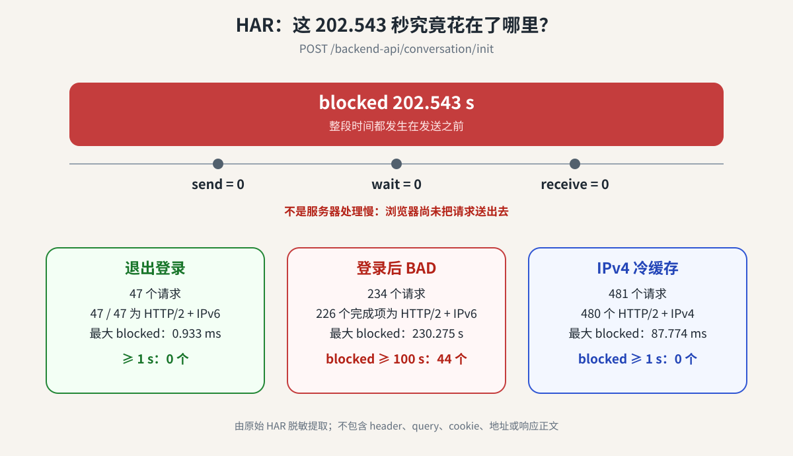
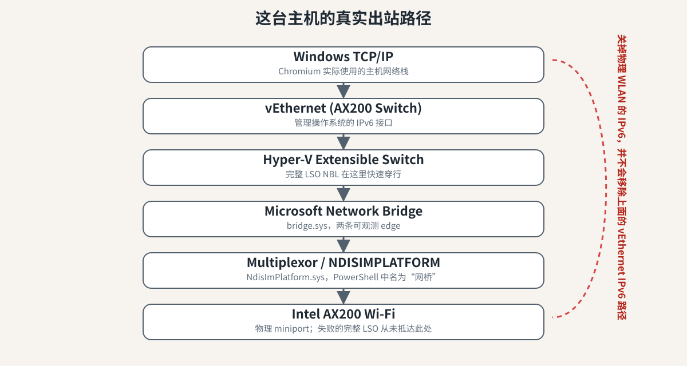
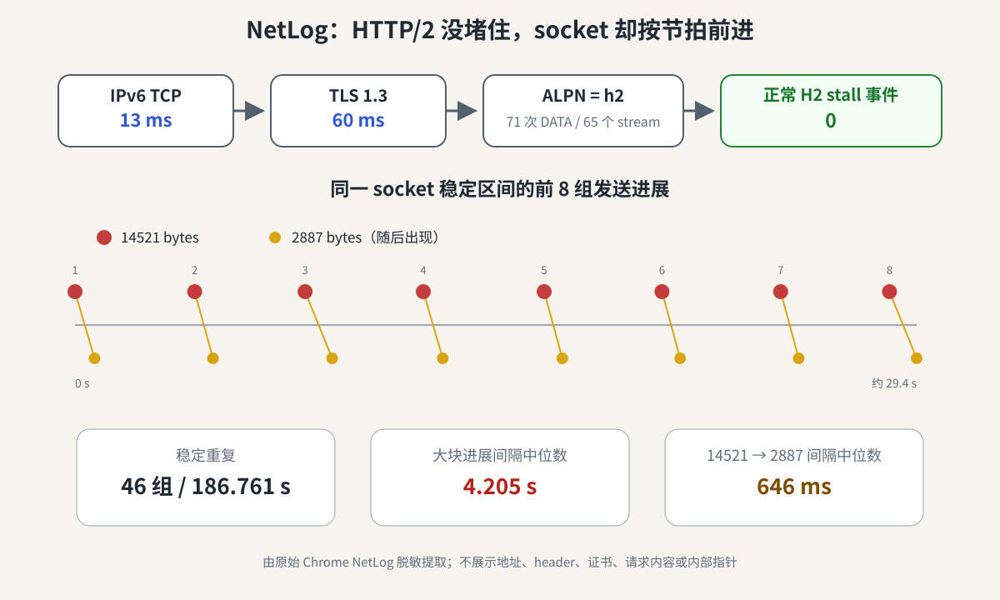
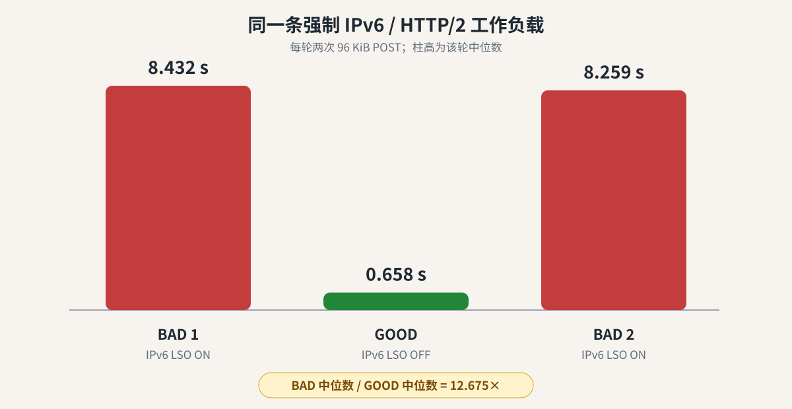
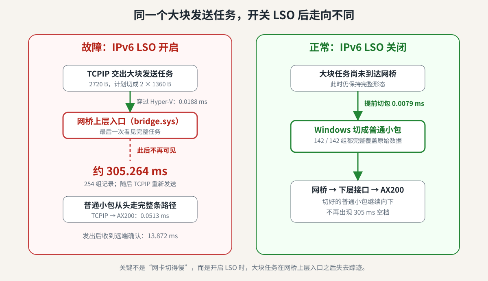
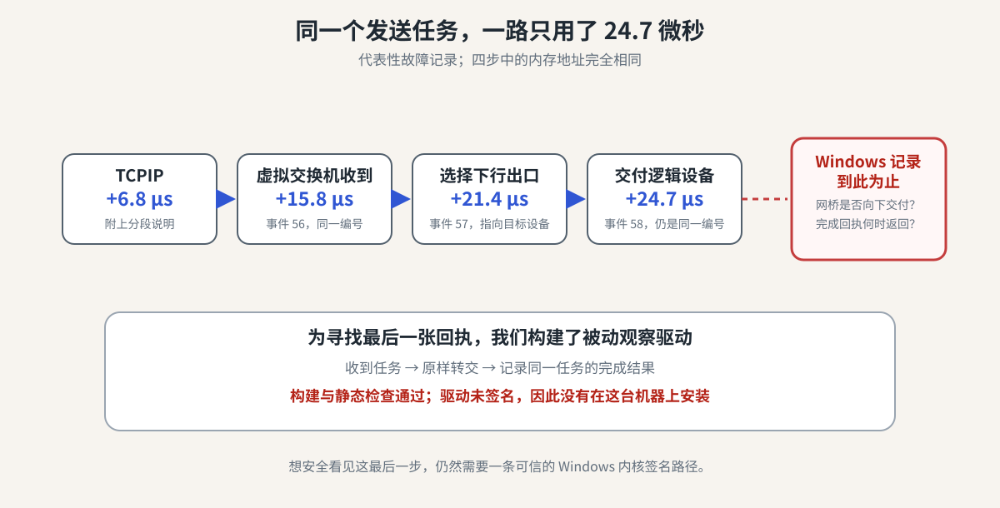

## 问题始于异常的 ChatGPT 网页版体验

事情的起点很普通：ChatGPT 网页版在我的 Windows 11 电脑上有问题，新对话无法发送信息（过一会以后报错），点开已有对话也一直转圈，加载 project 以及对话列表的速度都慢得异常。

这怎么看都像是账号、浏览器配置或者网站前端出了什么问题。于是我按照一般思路，把扩展、缓存、站点数据、浏览器 profile 轮流怀疑了一遍，无痕模式、清除网站数据、禁用扩展我都试过了，它们也很配合地浪费了我不少时间，我一无所获。VPN 和路由器也不太像：如果局域网或者出口有问题，为什么偏偏只有这一台 Windows PC 有问题？其他设备都没有发现任何异常。

最令人迷惑的还是登录状态。退出登录使用是正常的，但登录以后就不行，难道我的账号在服务器端触发了什么奇怪的慢路径？

后来才知道，登录并不是病因。它只是让页面产生了更多并发的认证请求，把一个本来躲在下面的故障放大到无法忽略。ChatGPT 只是屎山顶上那颗碰巧很敏感的樱桃。

## 两百秒，啥也没发出去

真正让调查有所进展的是浏览器导出的 HAR 记录。HAR 可以理解为浏览器对每个网络请求记下的一份流水账。里面不只有 URL 和状态码，还有请求在各个阶段花了多少时间。问题最严重时，`POST /backend-api/conversation/init` 的总耗时是 202.543010 秒，拆开以后可以发现明显异常：

| 阶段 | 时间 |
|---|---:|
| total | 202.543010 秒 |
| blocked | 202.543010 秒 |
| send | 0 |
| wait | 0 |
| receive | 0 |

另一个 `POST /backend-api/f/conversation/prepare` 更夸张：总耗时和 `blocked` 都是 230.274545 秒，其他三个阶段同样全为 0。

这几个字段容易读反，`send` 是把请求写出去所花的时间；`wait` 通常是请求发出后等待服务器首字节；`receive` 是接收响应。`wait=0` 并不代表服务器瞬间响应，因为这里连 `send` 都还是 0。两百多秒几乎全在 `blocked`，意思是浏览器在这段时间里根本还没有把请求送上网络。也就是说，这不是“模型思考了 202 秒”，甚至不是 OpenAI 后端处理了 202 秒。服务器在这两百秒里根本没有机会犯错。



单条记录可能有偶然性，整份 HAR 就没有这么好糊弄了。登录后的 BAD 样本共有 234 个请求，其中能同时确定协议和地址族的 226 项都是 HTTP/2 + IPv6；148 个请求超过 10 秒，97 个超过 100 秒，单是 `blocked` 超过 100 秒的就有 44 个。形成对照的是，退出登录的 HAR 里 47/47 个请求同样使用 HTTP/2 + IPv6，最大 `blocked` 却只有 0.933 毫秒，没有任何请求达到 1 秒。

这个反差也给“登录状态”换了一个更准确的身份：它不是根因，因为退出登录时协议和地址族并没有变；它是负载放大器。登录后多出来的并发认证和会话流量，是压死骆驼的最后一根稻草。这条证据把问题从“网站为什么这么慢”改写成了另一个问题：浏览器为什么连一个请求都发不出去？

## 可疑的 HTTP/2

继续收缩变量时，一个决定性因素出现了：让 Chromium 不使用 HTTP/2，问题就消失。

HTTP/1.1 往往需要多条连接并行处理许多资源；HTTP/2 则会在一条 TCP 连接上承载很多逻辑 stream。对网站来说，这能省掉大量连接成本；对排障来说，它也意味着一个底层 socket 出问题时，许多表面上互不相干的请求会一起停住。登录后的 ChatGPT 恰好会产生足够多的并发流量，因此症状比退出登录时夸张得多。

到这里，Chromium 的 HTTP/2 实现看起来很可疑。但继续把 IP 版本也纳入对照以后，在足以触发故障的登录状态工作负载下，结果变成了下面这样：【

| 协议组合 | 结果 |
|---|---|
| HTTP/2 + IPv6 | **BAD** |
| HTTP/1.1 + IPv6 | GOOD |
| HTTP/2 + IPv4 | GOOD |

这里不只靠肉眼看页面。以 IPv4 为主的 HAR 有 469 个请求，其中 467 个走 HTTP/2、417 个走 IPv4，`blocked` 超过 1 秒的数量是 0；清空缓存后的纯 IPv4 样本更重，共 481 个请求，其中 480 个明确是 HTTP/2 + IPv4，最大 `blocked` 也只有 87.774 毫秒，仍然没有任何请求的 `blocked` 超过 1 秒。HTTP/1.1 + IPv6 则来自单独的协议切换实验，同样正常。

这一步排除了两个很讨巧的解释：IPv4 之所以好，并不是因为退回了 HTTP/1.1；冷缓存之所以好，也不是因为请求少。数百个真实请求在 HTTP/2 + IPv4 下不会集体堵在发送前，偏偏换成 IPv6 后才出现这种灾难。

于是 HTTP/2 的嫌疑也发生了变化。它不是单独的充分条件，IPv6 也不是；即使两者同时存在，退出登录的轻负载仍然可以正常。更准确的说法是：HTTP/2 + IPv6 构成了坏路径，而足够密集的登录流量负责把它稳定暴露。HTTP/2 把更多应用数据压进同一条底层连接，让下面的发送路径更容易露馅。

不过这又产生了一个很尴尬的问题：我明明已经在物理无线网卡上关掉 IPv6 了，Chromium 是从哪里找来的 IPv6？

## 我关掉的 IPv6，原来不是我正在用的 IPv6

这台电脑的网络结构并不是“Windows TCP/IP 直接连 Intel AX200”这么朴素。它启用了 Hyper-V 外部交换机，宿主操作系统实际使用的是 `vEthernet (AX200 Switch)`。物理 AX200 在更下面负责承载，主机的 IP 栈则挂在虚拟网卡一侧。



Hyper-V 外部交换机可以粗略理解为插在主机与物理网卡之间的一台软件交换机。创建它以后，管理操作系统不一定继续把 TCP/IP 直接绑定在物理网卡上，而是通过自己的 vEthernet 端口进入虚拟交换机，再从外部端口走到物理设备。

因此，物理 WLAN 上的 IPv6 binding 确实是关闭的，但主机的 IPv6 路由仍然明确指向 `vEthernet (AX200 Switch)`。我关掉了楼下大门的一盏灯，然后站在楼上疑惑为什么房间还亮着。

这个发现解释了 Chromium 为什么仍能建立 IPv6 连接，也把一个之前被隐藏的网络拓扑拉到了台前。后面会看到，这条路径里除了 Hyper-V switch，还有 Microsoft Network Bridge、Multiplexor、NDISIMPLATFORM 和若干过滤器。此时，网页卡顿这个简单的问题终于露出它的獠牙。

## Chrome 已经把数据交下去了

HAR 只能告诉我请求卡在浏览器的网络阶段，不能告诉我具体卡在哪一层。于是，下一步我们开始捕获 Chrome NetLog。

原始 NetLog 把连接建立的过程记得很干净：IPv6 TCP 连接只用了 13 毫秒，TLS 1.3 握手用了 60 毫秒，ALPN 正常协商出 `h2`。同一个 HTTP/2 session 上记录到 71 次 DATA 发送，分布在 65 个 stream；最大并发 stream、session 发送窗口和 stream 发送窗口这三类常规 stall 事件全是 0，socket/SSL 写错误也是 0。

换句话说，门很快就开了，HTTP/2 也没有举牌说“流量控制不让我走”。但穿过门的车流依然诡异。同一条 socket 的稳定区间里，`SOCKET_BYTES_SENT` 连续重复了 46 组“14521 bytes，随后 2887 bytes”，横跨 186.761 秒。相邻 14521-byte 进展的间隔中位数是 4.205 秒，后面的 2887-byte 进展通常再迟 646 毫秒。前八组已经足够把那种节拍器般的停顿画出来：



14521 和 2887 这两个数字本身不是根因，也不能直接当成线上 TCP segment 大小；NetLog 看到的是浏览器在一条复用 socket 上汇总后的写入进展。它真正提供的证据是：HTTP/2 session 没有被常规并发或流控规则堵死，底层 socket 仍在前进，却只能周期性地挤出一点进展。

这里要提前说明一下：这里的 4.205 秒不是后面 PktMon 看到的约 305 毫秒。前者是 Chrome 在整条 TLS/HTTP/2 复用连接上观察到的聚合节奏，后者是隔离单个 LSO 失败与 TCP 恢复后测出的包级间隔。它们描述的是同一场灾难的不同层次，不是两个应该硬对齐的计时器。

所以“Chromium 的 HTTP/2 状态机坏了”这种说法也开始站不住脚。HTTP/2 在等 socket，socket 又在等 Windows 的发送路径继续向前。如果问题已经到了 socket 下面，那么再盯着 DevTools 就不会有新答案了。该轮到 PktMon 了。

## 每隔三百毫秒，网络才肯挪一步

PktMon 是 Windows 自带的组件级包监控工具。和只看线上帧的普通抓包不同，它可以记录同一个发送对象经过本机哪些网络组件、从组件哪条 edge 进入或离开。这正适合回答一个问题：数据究竟消失在哪一层？

最早的包视图里出现了一种高度规律的节奏：一个很大的发送对象出现，约 300 毫秒后才看到一个正常 MSS 大小的包，再过相似的时间又来一个。网络故障往往充满抖动，而这次的故障像拿着节拍器，稳定得有些不礼貌。

这时 LSO 进入了我们的调查范围。LSO 是 Large Send Offload，通常 TCP 数据最终要切成适合链路发送的小段，但为了降低 CPU 开销，Windows 可以先把一大块数据和一份“请在下面按这个 MSS 分段”的元数据一起交下去，让更低层的软件或硬件稍后完成分段。Windows 里承载一次这种发送操作的对象叫 [`NET_BUFFER_LIST`](https://learn.microsoft.com/en-us/windows-hardware/drivers/ddi/nbl/ns-nbl-net_buffer_list)，简称 NBL；可以暂时把它当成“一个发送任务及其附带说明”的容器。

这里用的是 IPv6 LSOv2。最初的模型非常顺手：上层交下去一个大 LSO，底层或网卡花了约 300 毫秒才把它切开，所以线上迟迟看不到小包。这个解释既符合早期包形状，也符合“关掉 offload 也许会变好”的直觉。下一步就是试着拨动这个开关。

## 开、关、再开

控制变量是 PowerShell 中名为 `网桥` 的适配器上的 IPv6 LSO。结果非常干净：

| IPv6 LSO 状态 | ChatGPT 表现 |
|---|---|
| ON | BAD |
| OFF | GOOD |
| ON | BAD again |

一次 OFF 变好还可能是巧合，ON → OFF → ON 的反转则很难用缓存、服务器波动或者心理作用解释。IPv6 LSO 不只是与故障相关，它对这条网络拓扑上的故障具有很强的因果控制力。

不过这个结果仍然不能回答“ChatGPT 是否触发了某个特殊行为”。毕竟原始工作负载带着登录状态、cookie、复杂前端和真实生产服务。要证明网站只是触发器，最好的办法就是把网站整个拿掉。

## 把 ChatGPT 踢出实验

后来的受控实验使用了一个不需要凭据的强制 IPv6、严格 HTTP/2 工作负载。每轮向公开 HTTP/2 服务发送两次 96 KiB POST；目的端、协议、payload 和路由保持不变，唯一有意修改的变量仍然是 Multiplexor 上的 IPv6 LSO 状态。

三个运行里，每个请求都确认使用 IPv6 和 HTTP/2，全部返回 HTTP 200，trace 丢失事件数为 0。结果如下：



BAD1 两次请求是 7513.330 和 9350.630 ms，中位数 8431.980 ms；GOOD 是 955.104 和 361.737 ms，中位数 658.421 ms；BAD2 是 8591.878 和 7925.598 ms，中位数 8258.738 ms。两轮 BAD 中位数的中位数为 8345.359 ms，是 GOOD 的 12.675 倍。

每轮只有两个请求，所以这不是一份可以拿去比较网站性能的统计报告。但它根本不需要承担这个任务：A/B/A 的方向反转比普通公网抖动大一个数量级，而且所有应用层条件都固定了。

从这一刻起，ChatGPT 正式被排除为根因。它只是第一个把这条 Windows 发送路径压到足以出现灾难性症状的应用。

## 三百毫秒后的小包，原来不是我们以为的东西

开、关、再开已经证明 LSO 能控制故障，但我们对“它为什么会慢”的第一种解释其实是错的。

最初的抓包只让我们看到：一个大块发送任务出现了，约 300 毫秒后又出现一个 1360 字节的小包。最顺手的解释当然是——下面某一层终于把大块数据切开了，只是切得非常慢。

后来我们让 PktMon 把每个 Windows 网络组件的经过位置也记下来，故事立刻变了。如果那个小包真是下层迟到的分段结果，它应该在负责切包的位置之后第一次出现。可实际情况是，它重新出现在整个发送路径的起点 `TCPIP6`，然后从头走过 Hyper-V、网桥、无线网络过滤层，最后才到 AX200。

这不像一个在流水线末端姗姗来迟的零件，更像是原来的包裹一直没有送达，于是发件处又寄了一份。

因此，约 305 毫秒后的小包更符合 TCP 恢复发送：原来的大块任务没有取得可见进展，TCP 发现数据仍未被确认，于是重新发出一个正常大小的数据包。在稳定故障区间，前一份确认信息指向的位置与这个新包的起点在 254/254 组记录中完全一致，也支持这个解释。

这里仍要留一道边界。PktMon 能证明小包是从 TCPIP 重新出发的，却没有告诉我们究竟是哪一个 TCP 计时器触发了它。因此可以叫它“恢复发送”，但不能顺手把它写成某一种已经被证实的超时机制。

这是整次调查里我最喜欢的一次转折。更精细的追踪没有替旧理论补证据，而是干脆告诉我们：之前想错了。

## 沿着路线，寻找最后一次签收

既然 305 毫秒后的小包是一次重新发送，真正的问题就变成了：原来那个大块发送任务去了哪里？



先看故障状态。TCPIP 交下来的有效数据是 2720 字节，要求以后按 1360 字节一段切开，恰好是两段。附带信息也能正确解读为 IPv6 LSOv2。换句话说，我们没有看到 TCPIP 一开始就写错“快递单”。

这个完整任务随后飞快穿过主机过滤层和 Hyper-V 虚拟交换机，附带的分段说明一路没有变化。它最后一次被 PktMon 看见，是在 `Microsoft Network Bridge` 的上层入口；到了同一组件的下层出口，以及更下面的 Multiplexor 和 AX200，就再也找不到它了。

在 254 组稳定记录里，从这里失去踪迹到 TCPIP 重新发出小包，中位时间是 305.264 毫秒。相比之下，大块任务穿过前面的 Hyper-V 路径只用了 0.0188 毫秒；只要 TCPIP 手里已经有一个普通小包，把它送到 AX200 也只需 0.0513 毫秒；无线网卡发出数据后，收到远端确认的中位时间也只有 13.872 毫秒。

于是“公网太慢”和“Wi-Fi 正在排队”都很难再解释这个节拍。远端在十几毫秒内便有回应，本机却花了三百多毫秒才决定重新发送。等待发生在本机，而且早于物理网卡真正发包。

再看正常状态。关闭下层接口的 IPv6 LSO 后，TCPIP 依然可以先创建一个大块任务，但 Windows 不再把它完整地送往网桥，而是在抵达网桥之前就用软件切成普通小包。这个转换的中位时间只有 0.0079 毫秒；142 组记录中，每一组小包加起来都与原始数据完全吻合，之后也都能正常走到 AX200。

所以关闭 LSO 并不是让某个慢吞吞的切包器忽然勤快起来，而是换了一条更安全的处理方式：趁大块任务还没走到出问题的位置，先把它切好。

## Windows 里有两个几乎同名的“网桥”

现在必须处理一个很有 Windows 风格的命名陷阱。

PowerShell 里名叫 `网桥` 的适配器，实际是 `Microsoft Network Adapter Multiplexor Driver`，对应 `NdisImPlatform.sys`。PktMon 的路径中却还有另一个 `Microsoft Network Bridge`，对应 `bridge.sys`。两个名字看起来像中英文翻译，位置又紧挨着，但它们确实是两个不同组件。

失败的大块任务最后出现在后者，也就是 `bridge.sys` 的上层入口（组件 277）；它没有出现在这个网桥的下层出口，也没有到达下面的 Multiplexor（组件 275）。我们通过 PowerShell 切换的虽然是 Multiplexor 的 LSO 能力，但那个开关只是影响上层会不会继续保留大块任务，并不能证明 Multiplexor 已经收到又弄丢了它。

同理，AX200 根本没见过这份失败的大块任务，不能因为机器使用 Intel 无线网卡就把锅扔给固件。Hyper-V 也只用了几十微秒便把任务送过了自己的地盘，不像那个三百毫秒的等待点。

调查范围至此已经很窄：任务到达了 `bridge.sys` 的上层入口，却没有留下继续向下的记录。`bridge.sys` 因而成为最值得怀疑的对象，但最后一台拍到包裹的摄像头，并不能自动证明摄像头旁边的人就是凶手。

## 给发送任务贴上唯一编号

PktMon 可以根据包的大小、方向和路径追踪它，却不总能证明不同组件看到的是内存里的同一个对象。为了排除“只是长得一样”的可能，我们又换到 ETW，利用 NBL 的内存地址给每个发送任务贴上临时的唯一编号。

这一次，三轮实验里的 68/68 个目标任务都能用同一个编号串起来：TCPIP 创建任务，Hyper-V 虚拟交换机接收它、选择出口，再把它交给 Multiplexor 所在的逻辑设备。代表性故障任务完成这段路只用了 24.7 微秒。



这再次证明了两件事：上半段确实很快，途中也没有被悄悄换成另一个任务。但它仍然没有回答最关键的问题——交到这个逻辑设备之后，究竟发生了什么？

Windows 的现成日志给了我们成千上万条消息，却偏偏没有记录决定性的三步：`bridge.sys` 有没有真的把任务交给下一层，下一层有没有接住，以及处理完成后有没有把结果交还回来。

最后一步在驱动世界里叫“完成”。它很像借东西时的回执：上层把一个发送任务交出去后，不能永远假设对方还拿着它；下层处理完毕，必须把同一个任务连同结果还回来。现在缺的正是这张回执。没有它，我们无法知道那 305 毫秒里任务到底握在谁手上。

而且，这不是把日志选项再多勾几个就能解决的。Windows 提供的这些事件从一开始就没有记录那次交接和回执；再精细的筛选，也不能从不存在的记录里变出答案。

## 为了最后一张回执，我们写了一个驱动

既然系统日志看不到，最直接的办法就是在那个交接位置放一个临时观察点。我们为此写了一个被动的 NDIS 轻量级过滤驱动。NDIS 可以粗略理解为 Windows 网络驱动之间传递任务的一套规则；轻量级过滤驱动则像设在路上的透明检查站，能够看到任务进来、被转交，以及完成结果回来。

我们只想观察三件事：

```text
收到大块发送任务
    -> 原样交给下一层
    -> 等待同一任务的完成回执
```

如果任务进入检查站、也确实被交了下去，却迟迟没有回执，问题就在更下面；如果它根本没有进入，问题就在网桥或更上面的交接处；如果回执很快显示成功，而物理网卡仍什么都没看到，那又会指向另一种错误。无论出现哪一种，最后的模糊地带都会再缩小一截。

这个驱动并不是纸上设计。它基于微软的[官方 NDIS 过滤驱动示例](https://github.com/microsoft/Windows-driver-samples/tree/main/network/ndis/filter)，只记录目标任务的编号、时间和结果，不修改、不复制、不丢弃，也不故意延迟任何网络数据。它只允许自己连接到目标 Multiplexor，避免跑到无关的网络路径上添乱。

驱动和配套记录程序都成功构建，严格警告检查、静态检查和安装文件验证也全部通过。然后，SignTool 给出了最后一条结果：

```text
Number of files successfully Verified: 0
Number of warnings: 0
Number of errors: 1

SignTool Error: No signature found.
```

这台机器一直保持 Secure Boot 和 HVCI 开启，测试签名模式与内核调试也都关闭。按照 Windows 的[内核模式代码签名策略](https://learn.microsoft.com/en-us/windows-hardware/drivers/install/kernel-mode-code-signing-policy--windows-vista-and-later-)，这种环境只会加载受信任的内核驱动；而我们构建出的整个驱动包没有可被系统信任的签名。

当然可以修改启动和安全策略，把机器切到适合驱动开发的测试环境。但为了追一个网页卡顿而降低日常系统的内核保护，已经越过了我愿意接受的边界。于是这个驱动没有被安装、绑定或加载，自然也没有任何运行结果。

这个结尾颇有 Windows 风味：我们从一个网页按钮一路写到了内核驱动，最后操作系统很合理地拦住我们，问了一句——“你是谁，我凭什么让你的代码进内核？”

## 把结论停在证据允许的位置

调查到这里并不是“什么都没找到”。相反，一个看似发生在网页上的问题，已经被压缩到 Windows 本机网络路径上一段很短的交接处。

可以确定的是，IPv6 LSO 控制着故障：开、关、再开会让问题跟着坏、好、再坏；换成完全不使用 ChatGPT 的 HTTP/2 请求，结果仍然一样。网站只是把问题放大了，并不是根因。

也可以确定，TCPIP 创建的大块发送任务本身没有明显错误。它在几十微秒内穿过 Hyper-V，到达 `Microsoft Network Bridge / bridge.sys` 的上层入口，随后不再产生可见的下行进展。约 305 毫秒后出现的小包来自 TCPIP 的恢复发送，并不是下面某层终于完成了迟到的分段。关闭下层接口的 LSO 后，Windows 会在网桥之前提前切包，故障随之消失。

还不能确定的，是哪一个二进制文件应当独自负责。`bridge.sys` 是最后一个明确看见完整任务的组件，因此是领先嫌疑人；但系统日志没有记录下一次交接，也没有记录同一任务的完成回执。问题仍可能出在 `bridge.sys`、NDIS、`NdisImPlatform.sys`，或者它们对于“谁来接任务、谁来切包、谁来归还任务”这套规则的配合上。

所以我不会写“Intel AX200 有 bug”，不会写“Multiplexor 已经实锤”，也不会写“`bridge.sys` 100% 有罪”。最强而不越界的结论是：

> 在这台 Windows 11 主机的特定网络结构中，一个正确形成的 IPv6 LSOv2 大块发送任务能够迅速穿过 TCPIP 和 Hyper-V，却在到达 `bridge.sys` 上层入口后失去可观测的下行进展。关闭 Multiplexor 的 IPv6 LSO 会让 Windows 提前完成软件分段，并消除故障。`bridge.sys` 是目前最值得怀疑的实现，但在拿到下一次交接和完成回执之前，还不能把它与 NDIS、`NdisImPlatform.sys` 或三者之间的配合问题彻底分开。

这已经比“ChatGPT 在这台电脑上好慢”前进了很远。

## 后记

回头看，真正推动调查的不是某个听起来很厉害的工具，而是一组组能让可能性变少的对照：登录与退出登录，HTTP/1.1 与 HTTP/2，IPv4 与 IPv6，暖缓存与冷缓存，LSO 开与关再开，以及 ChatGPT 与不带任何账号信息的合成请求。

其中最有价值的一步甚至不是证实 LSO，而是更精细的路径记录推翻了我们对三百毫秒小包的第一次解释。如果一次调查只允许理论被确认，不允许它被证据否定，最后得到的往往只是一个讲得很顺的错误故事。

现在还差最后一张交接与完成回执。我们知道观察点应该放在哪里，也已经把观察程序写了出来；只是想在不降低 Secure Boot 和 HVCI 的前提下继续，需要一条可信的内核签名路径。这一步更适合交给能够在正式签名环境中工作的微软工程师。

最开始，我只想知道为什么一个网页在一台电脑上特别慢。最后，这个很小的界面症状在脚下打开了一扇活板门，让我们一路从浏览器走进 Windows 内核网络栈，直到安全策略把门重新关上。

那颗樱桃没有多复杂。只是托住它的东西，确实很有 Windows 特色。
